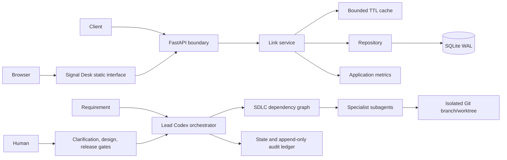
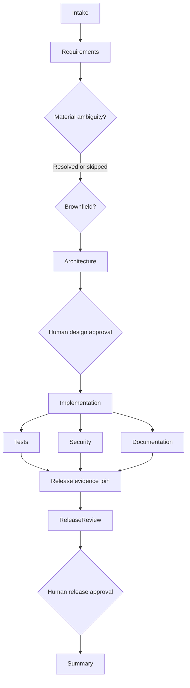

# Architecture overview

## Context

The URL shortener is a deterministic data-plane service. Codex and its subagents form a separate engineering control plane that modifies and validates the repository. This separation prevents model latency or failure from affecting redirects.

## URL-shortener components

- **FastAPI boundary:** validation, OpenAPI, authentication dependencies, error mapping, request IDs, and security headers.
- **Static web interface:** same-origin semantic HTML, CSS, and JavaScript for public creation and an operator
  workspace. Static routes are registered before the short-code catch-all, so redirect semantics remain unchanged.
- **Link service:** URL and alias policy, secure code generation, expiration semantics, idempotency, salted IP hashing, cache invalidation, and response composition.
- **Repository:** parameterized SQLite operations and transaction boundaries.
- **SQLite:** local durable prototype storage with foreign keys, busy timeout, indexes, and WAL mode.
- **Read-through cache:** reduces repeated metadata reads and is immediately invalidated by administrative disablement in the same process.
- **Metrics:** exposes create, redirect, error, rate-limit, and redirect-latency measurements in Prometheus text format.

## Agentic control-plane components

- **Lead Codex thread:** owns orchestration, context routing, synchronization, and final synthesis.
- **`AGENTS.md`:** global safety, delegation, quality, and code rules.
- **Custom agents:** narrow requirements, exploration, architecture, implementation, test, security, documentation, and release-review roles.
- **SDLC skill:** reusable execution procedure defining how to start, execute, replan, recover, and finish a run.
- **DAG:** machine-readable nodes, dependencies, conditional paths, gates, retry budgets, fallbacks, and rollback strategies.
- **Ledger utility:** atomically updates `state.json`, appends `events.jsonl`, validates agent result contracts, calculates metrics, and generates summaries.
- **Git:** authoritative change lineage and code recovery. JSON records reference commits; it does not duplicate or roll back source code.

## Orchestration control flow

Conditional nodes become `skipped`, which satisfies their dependency without inventing an output. Independent validation nodes become ready after implementation and may execute concurrently. The release-review node cannot run until all three complete.

## State, lineage, and replanning

Each run records requirement and output hashes, node attempts and states, actor-tagged events, artifact paths, approval inputs, Git baseline, timestamps, recovery events, and metrics. It intentionally excludes private chain-of-thought.

When an upstream decision changes, the ledger computes descendants, marks affected nodes `invalidated`, clears their active output hashes, and preserves old attempt artifacts and events. Only the affected subgraph reruns, and invalidated approval gates must be approved again.

## Failure and recovery model

- Transient failures may retry only within the node's declared budget.
- Permanent failure, exhausted retry budget, policy violation, or rejected gate triggers safe stop.
- Unmerged code is recovered by discarding its isolated worktree; known commits may be reverted when necessary.
- Database and deployment changes require explicit compensation strategies.
- Irreversible external effects are escalated and never falsely labeled rolled back.

## Key decisions

1. **Native agents rather than simulated Python agents:** Codex is the agent runtime; configuration files define specialists.
2. **Thin deterministic ledger:** code enforces state and audit properties that prose alone cannot prove.
3. **Single implementation owner:** avoids concurrent write conflicts while preserving parallel independent reviews.
4. **SQLite for the local prototype:** minimizes setup and supports transactional correctness; PostgreSQL is the production migration path.
5. **Dependency-free interface:** the original Signal Desk visual system uses server-packaged static assets, avoiding
   a frontend build pipeline while making the prototype easier to demonstrate.

## Web-interface trust boundary

The browser calls the existing JSON API on the same origin. Public creation needs no credential. The operator enters
the admin key at runtime; JavaScript keeps it in a closure, clears the input immediately, and never uses persistent
browser storage. API-derived strings enter the document through `textContent`, and generated links accept only HTTP
or HTTPS protocols. A UI-scoped Content Security Policy disallows inline code, plugins, framing, foreign network
connections, and foreign assets without affecting FastAPI's Swagger interface.

The route order is deliberate: exact `/`, then mounted `/_assets`, then API routes, and finally `/{code}`. Therefore
`/` renders the application shell while existing short codes retain the same HTTP 307 behavior.
